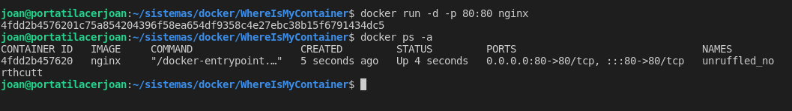
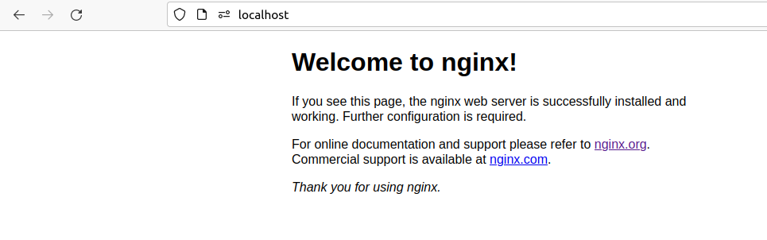
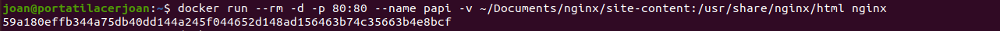
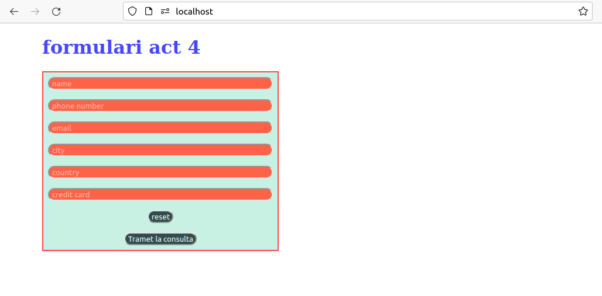
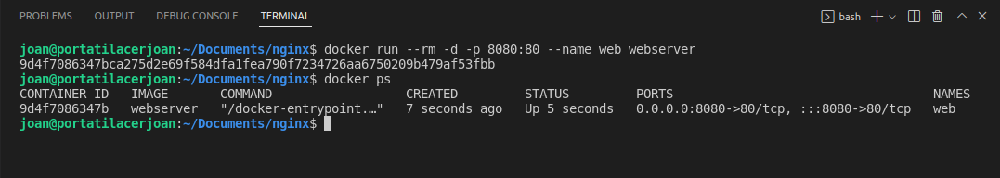
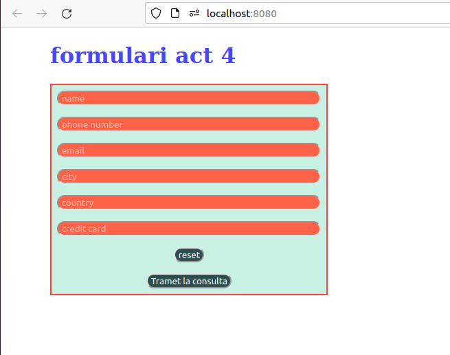
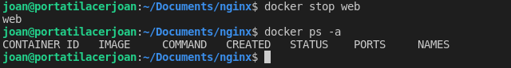

# WhereIsMyContainer
Docker container, this time using Nginx

### Intro:

This practice proposed by <a href="https://github.com/maximofernandezriera">Máximo</a> from <i>Sistemas Informáticos</i>  subject has the purpose of learning the basics about how docker containers and images work. Also introduces some concepts about creating images from a Dockerfile and the creating containers from it.

<hr>

### First part:

We are encouraged to build a container from <a href="https://hub.docker.com/_/nginx/">NGINX official image</a> and to do a port mapping (from the container to our local system) in order to visualize NGINX in our localhost.

So, by typing the following command, we will have Nginx up and running:

``` bash
docker run -d -p 80:80 nginx
```

- The -d means run the container in detach mode, so it will run in the background.

- And the -p 80:80 is done to do the port mapping commented recently.

Then if we execute a docker ps we can observe that nginx is up and running.



And in our localhost viewed as following:



<hr>

### Second part:

That's nice but... We wanna have a better index page, not just the boring welcome message that nginx provides us.

So, in order to do this, we will create a volume to join content from our machine to the container. So, when nginx searches for its index.html welcome page, it will be redirected to a file in our local filesystem and having a custom welcome page.

In order to create the volume we type the following command:



Things to be aware of:

- This time --name has been used to select a custom name to our container instead of having a random name from docker, which is always ingenious ;)

- the -v to create the volume (at left a file from our system and at right from the container)

Our file is a custom form with some css and javascript to do the validation, as we can see in the localhost:



<hr>

### Third part:

Finally, we will create our custom image from scratch (no at all). To do this, we will provide our custom welcome page to the index.html from Nginx. Because volumes are nice when working locally, but if a teammate needs to work with our custom image, building a Dockerfile is a better option.

So, let's create the Dockerfile and build and image from it:


Now we are able to run a container from this image:



And having the same result in our localhost:



But our image now could be distributed to <a href="https://hub.docker.com/">dockerhub</a>

Finally, can stop the container:



Notice the container has been deleted due to --rm option
